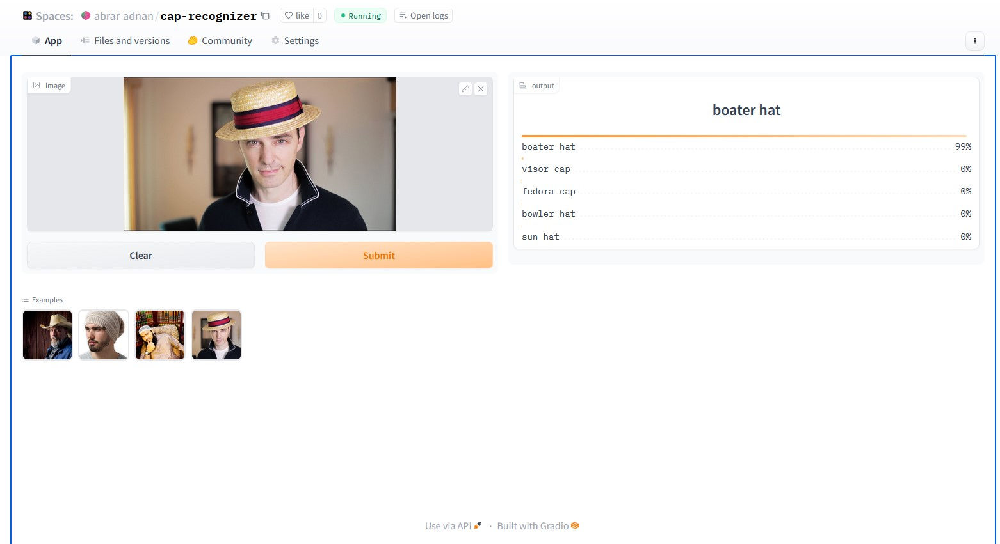

# cap-recognizer

An image classification from data collection, cleaning, model training, deployment and API integration.  
The model can Classify 20 different types of Caps  
They are:
1. balaclava cap
2. baseball cap 
3. beanie cap
4. boater hat 
5. bowler hat 
6. bucket hat 
7. cowboy hat 
8. fedora cap 
9. flat cap 
10. ivy cap 
11. kepi cap 
12. newsboy cap 
13. pork pie hat 
14. rasta cap 
15. sun hat
16. taqiyah cap 
17. top hat
18. trucker cap 
19. turban cap 
20. visor cap

# Dataset Preparation
**Data Collection:** Downloaded from DuckDuckGo using term name  
**DataLoader:** Used fastai DataBlock API to set up the DataLoader.  
**Data Augmentation:** fastai provides default data augmentation which operates in GPU.  
Details can be found in `notebooks/data_prep.ipynb`

# Training and Data Cleaning
**Training:** Fine-tuned a resnet34 model for 5 epochs (3 times) and got upto ~89% accuracy.  
**Data Cleaning:** This part took the highest time. Since I collected data from browser, there were many noises. Also, there were images that contained. I cleaned and updated data using fastai ImageClassifierCleaner. I cleaned the data each time after training or finetuning, except for the last time which was the final iteration of the model.  

# Model Deployment
I deployed to model to HuggingFace Spaces Gradio App. The implementation can be found in `deployment` folder or [here](https://huggingface.co/spaces/abrar-adnan/cap-recognizer).  

# API integration with GitHub Pages
The deployed model API is integrated [here](https://abraradnan.github.io/cap-recognizer/cap_recognizer.html) in GitHub Pages Website. Implementation and other details can be found in `docs` folder.
